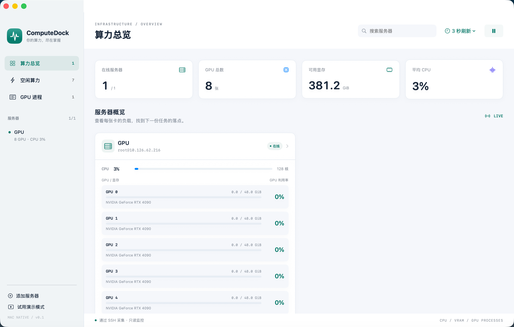
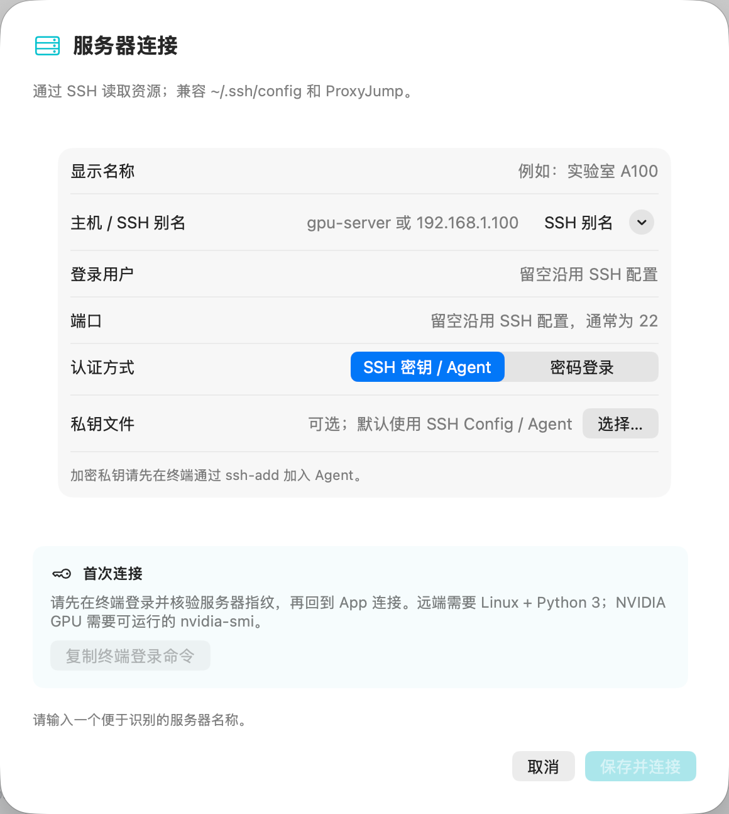

# ComputeDock

[简体中文](README_ZH.md) · [Apache-2.0](LICENSE)

A native macOS dashboard for monitoring Linux servers over SSH. Built with SwiftUI and the system OpenSSH client, with no third-party package dependencies.

## Screenshots

### Server overview



### SSH server connection



## Features

- Multiple-server overview with CPU usage, GPU count and available GPU memory.
- Per-GPU memory usage, utilization, temperature and power draw.
- GPU processes with PID, user, GPU index, process type, memory, CPU and command line.
- Searchable process table, memory/PID sorting and command copying.
- CPU, GPU and VRAM charts for the latest 120 samples.
- Idle GPU filtering, pause/resume and configurable 1/3/5/10-second sampling.
- Password, SSH key and SSH Agent authentication; existing SSH aliases and ProxyJump support.
- Clearly labeled demo mode for trying the interface without a server.

## Requirements

The packaged app targets **Apple Silicon Macs running macOS 14 or later**. The remote server needs **Linux and Python 3**. NVIDIA GPU metrics require a working **nvidia-smi**. The collector uses Python's standard library and does not install a daemon or write remote files.

## Build and test

Install Apple Command Line Tools or Xcode, Swift 5.9+, and Python 3, then run:

```bash
git clone https://github.com/Troy0630/ComputeDock.git
cd ComputeDock
./test.sh
./build.sh
open ../ComputeDock.app
```

Build caches default to `.build-local/`. Set `COMPUTEDOCK_BUILD_ROOT` to choose another directory. The optional first argument to `build.sh` selects the output app path.

## Connect a server

1. For a new host, first log in using Terminal and verify its SSH host key. The app rejects unknown or changed host keys.
2. Click **添加服务器** (Add server). Enter a label and a hostname, IP address or SSH alias. Empty user/port fields inherit your SSH configuration.
3. Choose password authentication, or SSH key/Agent authentication. Add encrypted keys to your agent with `ssh-add` first.
4. Save and connect. The default sample interval is three seconds.

Passwords remain in memory for the app session and must be re-entered after quitting. They are sent to SSH through a private temporary Unix socket, not command-line arguments, environment values or saved configuration.

The app uses `~/.ssh/config`. Aliases in included files can be entered manually. **Jump hosts must use keys or SSH Agent**; the destination server's password is not supplied to a jump host.

## Metrics

- System CPU is the delta between `/proc/stat` samples, normalized across all cores to 0–100%.
- Process CPU follows top-style accounting: one fully used core is 100%, so a process can exceed 100%.
- Used system memory is `MemTotal - MemAvailable`. GPU memory is displayed in GiB.
- The first CPU sample and unavailable driver metrics display `—`.
- GPU processes are listed per GPU, including compute and graphics processes. `/proc` permissions can limit user and command details.
- Idle GPU filtering requires utilization <10%, memory usage <10%, and no GPU processes.

Connection metadata is saved locally in `~/Library/Application Support/ComputeDock/servers.json`; passwords and private-key contents are excluded. History stays in memory.

## Contributing and license

See [CONTRIBUTING.md](CONTRIBUTING.md). Remove credentials and sensitive server details before posting logs or screenshots.

Copyright 2026 Troy0630. Licensed under [Apache License 2.0](LICENSE); see [NOTICE](NOTICE).

The dashboard layout was inspired by [RackTop](https://github.com/Tongzh-SEU/RackTop). ComputeDock's SwiftUI code, collector and icon were independently implemented.
